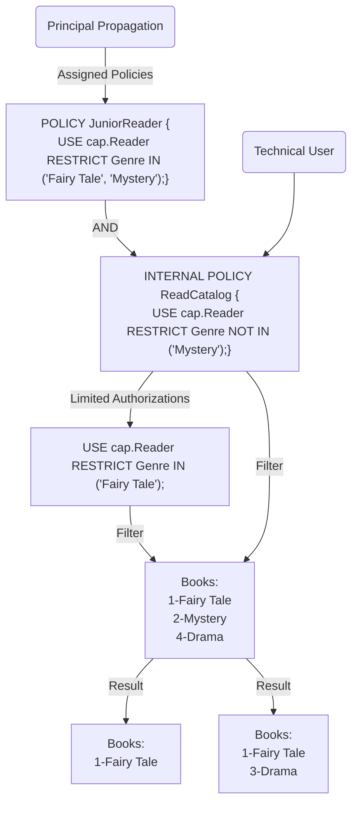

# Technical Communication

The Authorization Management Service (**AMS**) supports authorization of technical communication for both *technical users* (systems) and *principal propagation*. In principle propagation, user requests are forwarded, as documented below.

## App-to-App

The recommended strategy for authorizing technical communication requests in provider applications is to use SAP Cloud Identity Services [App-to-App Integration](https://help.sap.com/docs/cloud-identity-services/cloud-identity-services/consume-apis-from-other-applications). Here, the request of the caller is authorized by authorization policies in the provider application based on the consumed API permission groups. 

The consumed API permission groups can be found in the the `ias_apis` claim of the tokens from SAP Cloud Identity Services:

```json
{
  "ias_apis": [
    "amsValueHelp"
  ],
  "sub": "eecd1df6-9ad9-4341-81e3-d123f392b79e",
  "app_tid": "6898a89f-ad38-4a7f-9e7b-e89bd6bd7d40",
  "iss": "https://customer.accounts.ondemand.com",
  "given_name": "John",
  "sid": "S-SP-41b6acac-2696-4950-9902-a49968b4da14",
  "ias_iss": "https://customer.accounts.ondemand.com",
  "aud": "64926a29-3a02-47e4-af9d-08d41614c467",
  "scim_id": "eecd1df6-9ad9-4341-81e3-d123f392b79e",
  "user_uuid": "eecd1df6-9ad9-4341-81e3-d123f392b79e",
  "azp": "19e0fef0-9356-40e8-acb3-99346fc6abe4",
  "cnf": {
    "x5t#S256": "UHBKahftM5a85fsxFJMkkOKBE5RpmVr0oP_NmsFyrms"
  },
  "exp": 1748250699,
  "iat": 1748247099,
  "family_name": "Doe",
  "jti": "a480e303-ad35-48b5-93f0-49bbde317901",
  "email": "john.doe@example.org"
}
```

The claim is a list of API permission group names that the caller has requested and received during the token flow.

The decision **which application** may consume which API permission group is made by the administrator of the SAP Cloud Identity Services tenant, not by the application itself (see [Consume API from another application](https://help.sap.com/docs/cloud-identity-services/cloud-identity-services/consume-api-from-another-application)). The application itself only decides **which privileges** are granted to callers based on the API permission groups.

::: tip
The CAP authentication handlers use the list of `ias_apis` to automatically grant **cds roles** with the same name in case of **technical user** tokens. The strategy described below is only relevant outside CAP or if you want to use the API permission groups in the context of principal propagation requests.
:::

### API Policies

For each API permission group that is provided by the application, it defines an *internal* policy. This is a policy that is not visible to administrators.

For example, if the application provides an API permission group named `ExternalOrder` that can be used by external applications to place small orders, it could define the following internal policy that grants the intended privileges to callers of the API permission group. The fully qualified name of the policy is `internal.ExternalOrder` as it is defined inside a file of the `internal` DCL package:

:::code-group
```dcl [dcl/internal/apiPolicies.dcl]
INTERNAL POLICY ExternalOrder {
    USE shopping.CreateOrders RESTRICT order.total < 100;
}
```
:::

The policy's privileges are granted to **any** callers that can make requests for that API permission group. A distinction between different caller identities isn't made.

::: tip
It's best practice to map policies separately for the *technical user* and *forwarded user* flows. This way, the mapping function can be used to control which API permission group should be consumable in which flow by exclusively mapping API permission groups that are intended for the respective flow (see examples below).

If you want to define different privileges for technical und forwarded user tokens consuming the same API permission group, you can map the API permission group to different internal policies depending on the flow.
:::

### Authorization via API Permission Groups

For technical user requests, the resulting policy is used directly in subsequent authorization checks to determine the caller's privileges.

For principal propagation requests, the user's policies are used as a basis to determine the privileges and the policies derived from the consumed API permission groups are used to determine an upper limit for the privileges that are granted to the user during this request. This allows applications to restrict what external applications can do on behalf of the user, while also taking the user's policies into account for the decision.



::: info
Principal propagation requests that consume the special `principal-propagation` API permission group are authorized based on the user's policies without imposing an upper limit. This API permission group corresponds to `All APIs` consumption in the SCI administration console and can be [optionally provided](https://help.sap.com/docs/cloud-identity-services/cloud-identity-services/consume-apis-from-other-applications) by the application if it's not necessary to distinguish between internal and external user requests.
:::

### Mapping implementation
The *API Name -> Policy Name* mapping is typically implemented as a simple function in the application code.

::: tip
We recommend to name the internal policies the same as the API permission group names. This way, the mapping function becomes trivial, as it only needs to prefix the API permission group name with the DCL package in which the internal policies are defined, which is typically `internal`.
:::

::: warning
Avoid special characters in the API permission group names that need to be escaped to build a fully-qualified AMS policy name when you follow this tip!
:::

Example:

::: code-group
```js [Node.js]
const TECHNICAL_USER_APIS = [
    "ReadCatalog"
]

const PRINCIPAL_PROPAGATION_APIS = [
    "AMS_ValueHelp",
    "ReadCatalog"
]

function mapTechnicalUserApi(api) {
    if (TECHNICAL_USER_APIS.includes(api)) {
        return `internal.${api}`;
    }
}

function mapPrincipalPropagationApi(api) {
    if (PRINCIPAL_PROPAGATION_APIS.includes(api)) {
        return `internal.${api}`;
    }
}
```

```java [Java]
final Map<String, Set<String>> TECHNICAL_USER_API_TO_POLICY = Map.of(
    "ReadCatalog", Set.of("internal.ReadCatalog"));
final ApiMapper technicalUserApiMapper = ApiMapper.ofMap(TECHNICAL_USER_API_TO_POLICY);

final Map<String, Set<String>> PRINCIPAL_PROPAGATION_API_TO_POLICY = Map.of(
    "AMS_ValueHelp", Set.of("internal.AMS_ValueHelp"),
    "ReadCatalog", Set.of("internal.ReadCatalog"));
final ApiMapper principalPropagationApiMapper = ApiMapper.ofMap(PRINCIPAL_PROPAGATION_API_TO_POLICY);
```

:::

### Mapping registration
Finally, a bit of configuration is required to register the mapping functions, so that the correct policies apply when external requests are made against the API permission groups.

The mapping can be registered in `IdentityServiceAuthProvider` (Node.js) / `IdentityServiceAuthFactory` (Java) and its subclasses, such as `HybridAuthProvider` (Node.js) / `HybridAuthFactory` (Java).

::: info
These classes implement the special handling for the `principal-propagation` API permission group described [above](#authorization-via-api-permission-groups).
:::

::: code-group
```js [Node.js (CAP)]
const cds = require('@sap/cds');
const { amsCapPluginRuntime, CdsXssecAuthProvider, IdentityServiceAuthProvider, TECHNICAL_USER_FLOW, PRINCIPAL_PROPAGATION_FLOW  } = require("@sap/ams");
const { mapTechnicalUserApi, mapPrincipalPropagationApi } = require('./apis'); // import mapping functions

cds.on('bootstrap', () => {
    const cdsAuthProvider = amsCapPluginRuntime.authProvider;
    const authProvider = cdsAuthProvider.xssecAuthProvider;
    authProvider.withApiMapper(mapTechnicalUserApi, TECHNICAL_USER_FLOW);
    authProvider.withApiMapper(mapPrincipalPropagationApi, PRINCIPAL_PROPAGATION_FLOW);

    // or in typescript:
    const cdsAuthProvider : CdsXssecAuthProvider = amsCapPluginRuntime.authProvider as CdsXssecAuthProvider;
    const authProvider : IdentityServiceAuthProvider = cdsAuthProvider.xssecAuthProvider as IdentityServiceAuthProvider;
    authProvider.withApiMapper(mapTechnicalUserApi, TECHNICAL_USER_FLOW);
    authProvider.withApiMapper(mapPrincipalPropagationApi, PRINCIPAL_PROPAGATION_FLOW);
})
```

```js [Node.js]
const { IdentityServiceAuthProvider, TECHNICAL_USER_FLOW, PRINCIPAL_PROPAGATION_FLOW } = require("@sap/ams");

const authProvider = new IdentityServiceAuthProvider(ams)
    .withApiMapper(mapTechnicalUserApi, TECHNICAL_USER_FLOW)
    .withApiMapper(mapPrincipalPropagationApi, PRINCIPAL_PROPAGATION_FLOW);
```

```java [Spring Boot/Spring Boot (CAP)]
import static com.sap.cloud.security.ams.api.App2AppFlow.RESTRICTED_PRINCIPAL_PROPAGATION;
import static com.sap.cloud.security.ams.api.App2AppFlow.TECHNICAL_USER;

@Configuration
public class AmsAuthProviderConfiguration {

    @Autowired
    private IdentityServiceAuthProvider authProvider;

    @PostConstruct
    public void configureAuthProvider() {
        final ApiMapper PRINCIPAL_PROPAGATION_API_MAPPER = getPrincipalPropagationApiMapper();
        final ApiMapper TECHNICAL_USER_API_MAPPER = getTechnicalUserApiMapper();

        authProvider
                .withApiMapper(TECHNICAL_USER_API_MAPPER, TECHNICAL_USER)
                .withApiMapper(PRINCIPAL_PROPAGATION_API_MAPPER, RESTRICTED_PRINCIPAL_PROPAGATION);
    }
}
```

```java [Java]
import com.sap.cloud.security.ams.core.IdentityServiceAuthProvider;

import static com.sap.cloud.security.ams.api.App2AppFlow.RESTRICTED_PRINCIPAL_PROPAGATION;
import static com.sap.cloud.security.ams.api.App2AppFlow.TECHNICAL_USER;

IdentityServiceAuthProvider authProvider =
    new IdentityServiceAuthProvider(ams)
        .withApiMapper(TECHNICAL_USER_API_MAPPER, TECHNICAL_USER)
        .withApiMapper(PRINCIPAL_PROPAGATION_API_MAPPER, RESTRICTED_PRINCIPAL_PROPAGATION);
```
:::