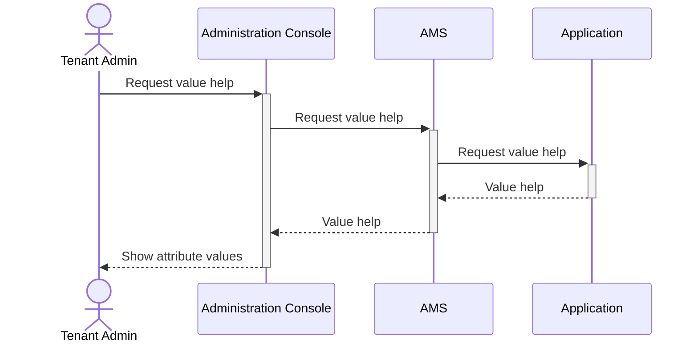

# Value Help

The administration console of SAP Cloud Identity Services provides a value help feature when an administrator creates restrictions of base policies. For example, using the following base policy:

```dcl
POLICY ReadProducts {
    GRANT read ON products WHERE category IS NOT RESTRICTED;
}
```

An administrator can use the administration console to create an authorization policy that is a restriction of the base policy for a specific category, such as "electronics":

```dcl
POLICY ReadElectronics {
    USE ReadProducts RESTRICT category = 'electronics';
}
```

The value help feature allows the administrator to select the `electronics` category (or any other category that exists in the application) from a list of available categories. This way, the administrator doesn't have to guess valid values for the `category` attribute, but can select valid values from a list.

Furthermore, the values can be shown with a human-readable label, such as *Electronic Devices* instead of showing the raw ID of the values.

#### Single Select Value Help
{width=250px}

#### Multi Select Value Help


## Implementation
To implement the value help feature, the following steps are necessary:
1. Implement [value help endpoints](#value-help-requests) in the application
1. Implement [authentication and authorization](#authorizing-value-help-requests) for the value help endpoints
1. Extend the Authorization Management Service (**AMS**) [service instance configuration](#ams-service-configuration) for value help
1. Add [value help annotations](#dcl-annotations) to attributes in the DCL schema

### Sample Implementation
The [Node.js CAP Sample](https://github.com/SAP-samples/ams-samples-node/tree/main/ams-cap-nodejs-bookshop) contains the required implementations specified below.

## Value Help Requests

To retrieve the list of available values for a specific attribute, the Authorization Management Service (**AMS**) can be configured to send value help requests to the application. In the response, AMS must receive a list of valid values for the requested attribute from the application and optionally, a human-readable label for each value, which it can then present to the administrator in the administration console.



### Request Processing

The AMS service instance is configured with a base URL of the value help service of the application, e.g.

```https://your-service.com/odata/v4/value-help```. 

Then, when AMS requests value help for a specific attribute such as `category`, by default, it will make a **GET** request to:

```https://your-service.com/odata/v4/value-help/category```

You can customize the path for each attribute using the `@valueHelp` annotation in the DCL schema, as described in the [Annotation Properties](#annotation-properties) section.

### Response Format

::: tip
CAP services served via the `OData` protocol implement the requirements below automatically including filtering. You can use [projections](https://cap.cloud.sap/docs/cds/cdl#views-projections) to define an entity for each attribute inside a dedicated value help service that exposes only the necessary fields (e.g., ID and name) in the response.
:::

The value help endpoints of the application must implement parts of the [OData V4 specification](https://www.odata.org/documentation/) to respond with a JSON payload containing the list of available options for the requested attribute.

```json
{
  "value": [
    {
      "ID": "electronics",
      "name": "Electronic Devices"
    },
    {
      "ID": "books",
      "name": "Books & Media"
    }
  ]
}
```

The response must contain:
- **value**: Array containing the list of available options
- **ID**: The actual value to be used in policies (must fit the DCL attribute data type)
- **name**: (*optional*) human-readable label displayed to administrators (`<= 50` characters for optimal displayability) instead of the ID

::: tip
It is possible to use different property names for the value and label fields. You can configure these names using the `@valueHelp` annotation in the DCL schema, as described in the [Annotation Properties](#annotation-properties) section.
:::

### Request Parameters
Value Help requests contain the following parameters that should be considered when building the response.

#### Tenant
In multi-tenant applications, if the resulting values depend on the tenant, the application must filter data based on the `app_tid` claim in the token sent by AMS, as usual.

#### User Language
If the application supports multiple languages, the `Accept-Language` header contains the language preferences of the administrator using the administration console. The application can use this information to return localized labels in the response.

#### Dependent Filters
If the attribute for which value help is requested [depends on other attributes](#dependent-attributes), AMS will include the current values of these attributes as OData filter parameters in the request, e.g.

```https://your-service.com/odata/v4/ValueHelpService/city?$filter=country eq 'DE'```


## Authorizing Value Help Requests

The value help endpoints in your application MUST be protected because they return business data. To allow the application to authorize value help requests, the AMS server calls the application with an [App-To-App](/Authorization/TechnicalCommunication#app-to-app) principal propagation token based on the administrator who requests value help in the administration console.

### API Permission Group

The API permission group consumed by the AMS server can be freely chosen in the service configuration of the AMS instance.
Make sure to setup a policy for this API permission group that limits privileges to those that are necessary for the value help endpoints as described in the [App-To-App](/Authorization/TechnicalCommunication#app-to-app) documentation.

Note that the API policy is just an upper limit for the privileges that can be used with this token. The administrator using the administration console must additionally have the necessary privileges based on assigned policies to access the value help endpoints in your application.

::: tip
Depending on your application, it may not be necessary to create a dedicated role or *action*/*resource* for the value help endpoints.
For example, if there is already a policy that grants read access to categories, you can reuse this policy in the *internal* policy to which the value help API permission group is mapped.
:::

### Certificate Validation
The value help request from the AMS server uses mTLS with a certificate that must be used to validate ownership of the token during authentication.

::: tip
The official BTP security libraries for authentication provide the necessary proof-of-ownership validation under the names `x5t validation` and `proof token validation`.
:::

::: warning Platform-specific certificate handling
As the ingress of the cloud platform terminates TLS, the certificate of the caller needs to be forwarded to your application, by default in the `x-forwarded-client-cert` header.

If your application is deployed on Cloud Foundry, the `.cert` domain must be used for the value help callback URL.
Cloud Foundry accepts client certificates only on this domain. In this case, it automatically fills the `x-forwarded-client-cert` header that is used during the validation.

If your application is deployed on Kyma, `Istio`/`Envoy` must be [configured](https://www.envoyproxy.io/docs/envoy/latest/api-v3/extensions/filters/network/http_connection_manager/v3/http_connection_manager.proto#envoy-v3-api-field-extensions-filters-network-http-connection-manager-v3-httpconnectionmanager-set-current-client-cert-details) to forward the client certificate to your application inside the `cert=` property of the `x-forwarded-client-cert` header.
:::

## AMS Service Configuration

To enable value help functionality, configure your AMS service instance with the value help callback URL and API settings.

### Service Instance Configuration

Add the following configuration to your AMS service instance parameters:

```json
{
  "authorization": {
    "enabled": true,
    "value-help-url": "https://myapp.cert.cfapps.sap.hana.ondemand.com/odata/v4/value-help/", // [!code ++:2]
    "value-help-api-name": "AmsValueHelp"
  },
  "provided-apis": [
    { // [!code ++:5]
      "name": "AmsValueHelp",
      "description": "Value Help Callback from AMS",
      "type": "internal"
    }
  ]
}
```

### Configuration Parameters

- **value-help-url**: The base URL of your OData V4 value help service. AMS will append paths of different attributes to this URL when making requests.
- **value-help-api-name**: The name of the API that AMS will use for App2App token requests. This must match an entry in the `provided-apis` section.
- **provided-apis**: Configure a dedicated API for AMS value help. We recommend to set the type to `internal` but `public` is possible if desired.


## DCL Annotations

You must enable value help for individual DCL attributes using the `@valueHelp` annotation in your DCL schema.

### Annotation Properties

Configure value help for an attribute as follows:

```dcl
SCHEMA {
  salesOrder: {
    @valueHelp: { // [!code ++:5]
      path: 'countries',
      valueField: 'code',
      labelField: 'description'
    }
    country: String
  }
}
```

- **path**: The path appended to the *value-help-url* when requesting value help for this attribute
- **valueField**: Property name in the OData response that contains the value
- **labelField**: Property name in the OData response that contains the human-readable label

### Default Annotation Values

You can omit one or multiple properties of the `@valueHelp` annotation to use default values. For example:

```dcl
SCHEMA {
  product: {
    @valueHelp: { // [!code ++:3]
      path: 'categories' 
    }
    category: String
  }
}
```

To omit all properties, you can also set `@valueHelp` to `true` (or `{}`):

```dcl
SCHEMA {
  product: {
    @valueHelp: true // [!code ++]
    category: String
  }
}
```

In this case, AMS uses these defaults:
- **Path**: Lowercase version of the attribute name (e.g., `Category` → `/category`)
- **Value field**: `ID` property in the response
- **Label field**: `name` property in the response

### Disabling Value Help

If no `@valueHelp` annotation is present for an attribute, the value help is disabled for this attribute. For attributes with disabled value help, no button or dialog will be shown in the UI. 

Alternatively, you can set the `@valueHelp` annotation to `false`, to explicitly disable the value help for an attribute:

```dcl
SCHEMA {
  product: {
    @valueHelp: false // [!code ++]
    internalId: String
  }
}
```

## Dependent Attributes
If the valid values for an attribute depend on other attributes, you can configure these dependencies in the `@valueHelp` annotation using the `filters` property.

```dcl
SCHEMA {
  salesOrder: {
    @valueHelp: { // [!code ++:5]
      filters: {
        'salesOrder.country': 'country'
      }
    }
    city: String,
    country: String
  }
}
```

In this example, the valid values for `salesOrder.city` depend on the value of `salesOrder.country`. When requesting value help for `salesOrder.city`, AMS will include the current value of `salesOrder.country` as a filter parameter with name `country` in the request if the administrator has already restricted that attribute in the same `RESTRICT` statement`.

For example, given the following state of the `RESTRICT` statement in the administration console:

```dcl
POLICY BookGermanTours {
  USE BookTours 
    RESTRICT salesorder.country = 'de', salesorder.city <to be restricted>;
}
```

If the administrator requests value help for `salesorder.city`, AMS will make the following request to the application: 

```https://your-service.com/odata/v4/value-help/city?$filter=country eq 'DE'```

If an attribute is filtered by more than one other attribute, the filter conditions are combined with `and`, e.g.

```https://your-service.com/odata/v4/value-help/city?$filter=country eq 'DE' and region eq 'BY'```

::: warning Note
If an attribute defined as filter is not restricted yet, no filter condition will be sent for this attribute.
:::

::: tip
The administration console automatically orders the list of attributes in the `RESTRICT` statement, so that attributes that other attributes depend on are at the top. This works only when there are no circular dependencies between attributes though!
:::

### Filter operators
The following list shows how DCL operators are translated into OData filter expressions:

| DCL Operator | OData filter query operator |
| - | - |
| = | eq `[value]` |
| &lt;&gt; | ne `[value]` |
| &gt; | gt `[value]` |
| &gt;= | ge `[value]` |
| &lt; | lt `[value]` |
| &lt;= | le `[value]` |
| BETWEEN | ge `[value1]` and le `[value2]` |
| NOT BETWEEN | lt `[value1]` or gt `[value2]` |
| IN | in (`[values...]` ) |
| NOT IN | not(in (`[values...]`)) |
| IS NULL | eq null |
| IS NOT NULL | ne null |
| LIKE | matchesPattern(`[field]`, `[value]`) |
| NOT LIKE | not(matchesPattern(`[field]`, `[value]`)) |
| IS RESTRICTED | - (Not relevant for Value Help) |
| IS NOT RESTRICTED | - (Not relevant for Value Help) |