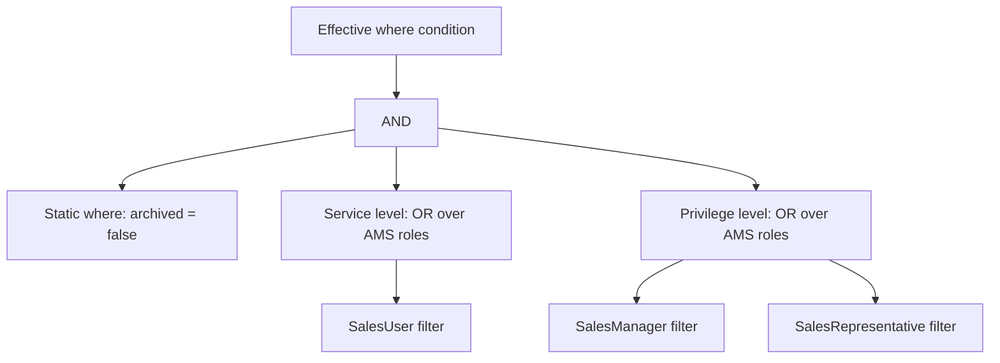

# Instance-Based Authorization

Policies that assign roles can be extended with attribute filters for instance-based authorization. This allows administrators of different tenants to define fine-grained policies with individual restrictions at runtime to customize the authorization model for their tenant.

## Motivation

Let's imagine a scenario where we want to enable tenant administrators to give users the `SalesRepresentative` role but only for a specific `Region` and `ProductCategory`.
For example, the following policy would grant the `SalesRepresentative` role only in the `EU` region and only for products in the `Electronics` category:

```dcl
POLICY SalesRepresentativeEUElectronics {
    ASSIGN ROLE SalesRepresentative 
    WHERE Region = 'EU' AND ProductCategory = 'Electronics'; // [!code ++]
}
```

However, administrators can't simply write arbitrary DCL policies as free text because it's important that the application supports the conditions that are used in the policies. In this example, the application must understand how and where to apply the conditions for `Region` and `ProductCategory`.

In the next sections, we explain the necessary steps in the application to achieve this example.

## Schema Definition

As a basis, attributes used in policies must be defined in a `schema.dcl` file. This file must be located in the [DCL root folder](/CAP/Basics#dcl-root-folder) of the CAP application.

In this file, the data type of the attributes is defined, and it can also contain additional metadata annotations, such as those for [Value Help](/Authorization/ValueHelp).

```dcl
SCHEMA {
  @valueHelp { ... }  // details omitted for brevity
  Region : String,
  
  @valueHelp { ... } // details omitted for brevity
  ProductCategory : String,
}
```

::: tip Schema Generation
The Authorization Management Service (**AMS**) Node.js module [`@sap/ams`](https://www.npmjs.com/package/@sap/ams) can be used to [generate](/CAP/cds-Plugin#base-policy-generation) the `schema.dcl` from [`@ams.attributes`](#annotating-the-cds-model) annotations in a cds model.
:::


## Restricted Role Assignments

To provide guardrails for runtime policies, it's possible to extend role assignments in the base policies with a `WHERE` condition. In that condition, the `IS NOT RESTRICTED` and `IS RESTRICTED` keywords can be used to list the attributes that can (must) be restricted by the tenant administrator at runtime.

##### IS RESTRICTED
When assigning a base policy with an attribute that `IS RESTRICTED`, the attribute condition evaluates to `false`, which typically means access by assigning the base policy isn't possible at all. To gain access, administrators **must** derive a runtime policy from this base policy that restricts the attribute to a specific value.

##### IS NOT RESTRICTED
When assigning a base policy with an attribute that `IS NOT RESTRICTED`, the attribute condition evaluates to `true` which means the base policy can be assigned for unfiltered access. However, administrators **can** derive a runtime policy from this base policy to restrict the attribute to a specific value.

In our example, we want to allow (but not force) the tenant administrator to restrict the `Region` and `ProductCategory` attributes, so we extend the `SalesRepresentative` base policy as follows:

```dcl
POLICY SalesRepresentative {
    ASSIGN ROLE SalesRepresentative
    WHERE Region IS NOT RESTRICTED AND ProductCategory IS NOT RESTRICTED; // [!code ++]
}
```

::: warning
In CAP, `WHERE` conditions behind role assignments must only be used to determine **what** users with the role are allowed to see. Don't try to use it as a means to check **if** the role is assigned or not based on attribute conditions.
:::

### Combining Attribute Conditions
Usually, when there are multiple attributes in the `WHERE` condition of a rule, developers want to combine the filter conditions of all attributes using `AND`. However, it's also possible to use `OR` to combine attribute conditions.

::: tip Partial Restrictions
In both cases, it's important to consider the effects of the `IS RESTRICTED` and `IS NOT RESTRICTED` keywords. For example, administrators can decide to leave some attributes as `IS RESTRICTED` (`IS NOT RESTRICTED`) in a derived policy by restricting only a subset of attributes to specific conditions. The evaluation to `false` (`true`) of the `IS RESTRICTED` (`IS NOT RESTRICTED`) attributes will short-circuit the evaluation of the remaining attributes in the same `AND` (`OR`) clause.

For this reason, when using `IS NOT RESTRICTED`, we discourage the use of `OR` in the `WHERE` clause of role assignments because it can lead to unintended full access.
:::

## Runtime Policy Creation

Once the previous steps are in place, the tenant administrator can use the `SCI admin cockpit` to create a runtime policy from the base policy that restricts the `Region` and `ProductCategory` attributes to specific values.

::: tip
For local tests, such a derived policy can be written in a DCL file inside the [`local`](/Authorization/Testing#test-policies) DCL package.
:::

```dcl
POLICY SalesRepresentativeEUElectronics {
    USE cap.SalesRepresentative
    RESTRICT Region = 'EU', ProductCategory = 'Electronics';
}
```

This derived policy is equivalent to the policy defined in the [Motivation](#motivation) section. It can be assigned to users in the same tenant like any other policy.

## Annotating the CDS Model

Finally, via `@ams.attributes` annotations, the AMS attributes are mapped to elements (or association paths) in the cds model using compile-safe cds expressions. Whenever requests access the annotated resources, the result is filtered based on the attribute conditions computed by AMS.

```js
annotate Product with @ams.attributes: { // [!code ++:8]
    ProductCategory: (category),
};

annotate SalesOrder with @ams.attributes: {
    Region: (region),
    ProductCategory: (product.category),
};

annotate Product with @restrict: [
    {
      grant: ['READ'],
      to: [ 'SalesManager', 'SalesRepresentative' ]
    }
];

annotate SalesOrder with @restrict: [
    {
      grant: [ 'CREATE', 'READ', 'UPDATE', 'DELETE' ],
      to: 'SalesManager',
    },
    {
      grant: [ 'READ' ],
      to: 'SalesRepresentative',
    },
];
```

::: tip
`ams.attributes` annotations are supported on *aspects*, *entities*, and *actions/functions bound to a single entity*. They are the [cds resources that support *where* conditions](https://cap.cloud.sap/docs/guides/security/authorization#supported-combinations-with-cds-resources).
:::

## Effect of Attribute Filters

When the `SalesRepresentativeEUElectronics` policy is assigned to a user, the CAP modules for AMS dynamically adjust the cds `where` conditions of the privileges during each request to inject the attribute conditions from authorization policies. The AMS module adjusts privileges temporarily for the current authorization check only; the cds model itself isn't changed for other contexts.

For example, when accessing the `SalesOrder` entity above with the `SalesRepresentativeEUElectronics` policy, the AMS module will add a `where` condition to the second privilege (for the `SalesRepresentative` role) that looks like this:

```js
@restrict: [
    {
      grant: [ 'READ' ],
      to: 'SalesRepresentative',
      where: "region = 'EU' AND product.category = 'Electronics'", // [!code ++]
    },
]
```

::: tip
After adjusting the `where` condition, the CAP framework will enforce the attribute-based restrictions as usual. In particular, the AMS plugin is not directly responsible for `403` response codes.
:::

### Details

The AMS module computes the filter separately for each privilege whose role requirements are met and applies the filters with the following strategy.

1. **Collect the required roles.** The AMS module determines the roles required on 
- *service level* (`@requires` or `@restrict` of the service)

and on
- *privilege level* (`@restrict` or `@requires` on an entity, action, or function). If the entity, action, or function has multiple privileges, each is considered separately.

On each level, only the roles that the user actually got from AMS policies are considered. Other roles of the user are ignored for the filter computation. If a level (implicitly or explicitly) grants access to the pseudo-roles `any` or `authenticated-user`, filters are only computed for the other level because this one is already fully accessible without an AMS policy.

2. **Compute a condition for each role.** For each of these roles, the AMS module computes an individual condition based on the user's policies that assign that role. The condition is either `true` (unrestricted access), `false` (no access), or an attribute condition on the elements mapped via `@ams.attributes`.

3. **Combine the roles within a level with `OR`.** One of the roles listed on each level is sufficient to satisfy the role requirement, so the conditions for these roles are combined with `OR`. For example, if the second privilege for `SalesOrder` also allowed `READ` with the `SalesManager` role and the user in our example additionally had a policy with unfiltered access for `SalesManager` assigned, the resulting `where` condition would effectively look like this (before being simplified by the AMS module):

   ```js
   @restrict: [
       {
         grant: ['READ'],
         to: [ 'SalesManager', 'SalesRepresentative' ],
         where: "true OR (region = 'EU' AND product.category = 'Electronics')", // [!code ++]
       }
   ]
   ```

4. **Combine the levels with `AND`.** The user must pass both the service level and the privilege level role annotations, so the conditions of the two levels are combined with `AND`.

5. **Combine with the static `where` condition using `AND`.** When there is already a static `where` condition on the privilege, it's combined with the AMS filter by using `AND`. If the AMS filter is `true`, the privilege remains unchanged. If it's `false`, the privilege no longer grants access.

#### Example

In the following model, the service requires the `SalesUser` role, and the privilege on `SalesOrder` has a static `where` condition:

```js
annotate SalesService with @requires: 'SalesUser';

annotate SalesOrder with @restrict: [
    {
      grant: [ 'READ' ],
      to: [ 'SalesManager', 'SalesRepresentative' ],
      where: 'archived = false'
    },
];
```

For a user who has all three roles assigned via AMS policies, the `where` condition of the privilege effectively becomes:

```js
where: "(archived = false) AND (<SalesUser filter>) AND (<SalesManager filter> OR <SalesRepresentative filter>)"
```



::: tip Mixing AMS with Non-AMS Roles
If the application makes use of additional roles that are not granted **by AMS policies**, e.g. because they are assigned by custom application logic, you should not mix them with AMS roles in cds annotations. Otherwise, the filters for the AMS role will be applied to the privilege which may not be desired if the application intended unfiltered access with the other role.

```js
// Auditor is NOT assigned via AMS policies (e.g., it comes from a custom role mapping)

// Avoid: users with both Auditor and SalesRepresentative role get the SalesRepresentative filter
annotate SalesOrder with @restrict: [
    { grant: 'READ', to: [ 'SalesRepresentative', 'Auditor' ] },
];

// Prefer: Auditor grants full access, while SalesRepresentative role on its own is still filtered by AMS
annotate SalesOrder with @restrict: [
    { grant: 'READ', to: 'SalesRepresentative' },
    { grant: 'READ', to: 'Auditor' },
];
```
:::