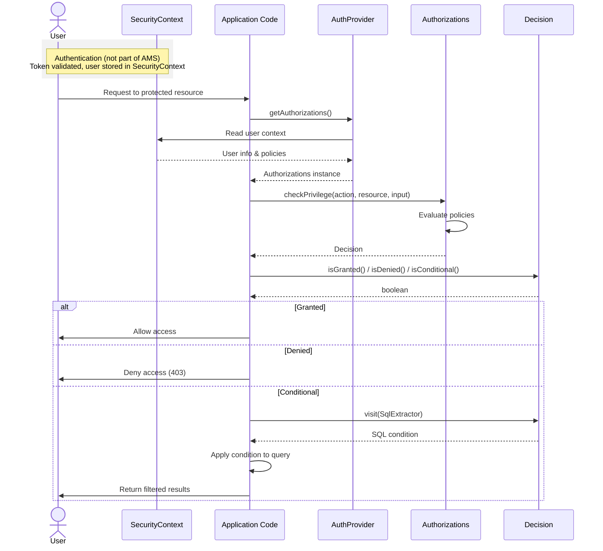
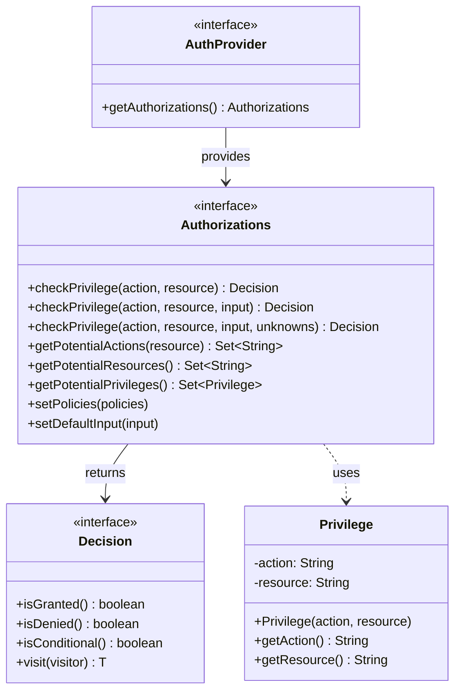

# jakarta-ams

`jakarta-ams` is the core Java library used to perform [authorization checks](https://help.sap.com/docs/identity-authentication/identity-authentication/configuring-authorization-policies?locale=en-US) in applications based on AMS policies.

::: tip CAP applications
CAP applications use this library transitively via `cap-ams-support`. The CAP module performs authorization checks automatically under the hood, so you typically don't need to use jakarta-ams directly.
:::

## Installation

The module is available in the SAP Maven repository:

```xml
<dependency>
    <groupId>com.sap.cloud.security.ams</groupId>
    <artifactId>jakarta-ams</artifactId>
    <version>${sap.cloud.security.ams.version}</version>
</dependency>
```

::: danger Important
Always keep the version of this dependency up-to-date since it's a **crucial part of your application's security**:

```bash
mvn versions:use-latest-versions -Dincludes=com.sap.cloud.security.ams:jakarta-ams
```
This is especially important when you deploy your application with a locked dependency version.
:::

:::tip
To check which version of the module is installed, run:

```bash
mvn dependency:tree -Dincludes=com.sap.cloud.security.ams:jakarta-ams
```
This prints a dependency tree that shows which versions of the module are installed, including transitive dependencies.
:::

## Usage

The following snippets show you how to use the core API of the library. For more details on the authorization concepts, see [Authorization Checks](/Authorization/AuthorizationChecks).

### Setup

#### Initializing AuthorizationManagementService

The `AuthorizationManagementService` is the central entry point for performing authorization checks. It manages the policy bundle and provides `Authorizations` objects for checking privileges.

```java
import com.sap.cloud.security.ams.v4.api.*;
import com.sap.cloud.security.ams.v4.core.*;
import com.sap.cloud.security.config.*;
import com.sap.cloud.environment.servicebinding.api.*;

AuthorizationManagementService ams;

if (isLocalTestEnvironment()) {
    // For local tests, initialize AMS with a locally compiled policy bundle
    ams = AuthorizationManagementServiceFactory.fromLocalDcn(
        "./test/dcn",  // your compile target directory
        new LocalAuthorizationManagementServiceConfig()
            .withPolicyAssignmentsPath(Path.of("./test/mockPolicyAssignments.json"))
    );
} else {
    // For production: Initialize from SAP Identity Service credentials
    
    // Option 1: Using service binding from BTP Service Binding Library
    ServiceBinding identityBinding = DefaultServiceBindingAccessor.getInstance()
        .getServiceBindings().stream()
        .filter(b -> "identity".equals(b.getServiceName().orElse("").toLowerCase()))
        .findFirst()
        .orElseThrow(() -> new IllegalStateException("No identity service binding found"));
    
    ams = AuthorizationManagementServiceFactory.fromIdentityServiceBinding(identityBinding);
    
    // Option 2: Using SAP Cloud Security Services Library
    OAuth2ServiceConfiguration iasConfiguration = Environments.getCurrent().getIasConfiguration();
    ams = AuthorizationManagementServiceFactory.fromIasServiceConfiguration(iasConfiguration);
    
    // Option 3: Convenience method that works for both production and testing
    // Uses DCN_ROOT env variable to differentiate: if set, uses local DCN; otherwise uses IAS credentials
    ams = AuthorizationManagementServiceFactory.fromEnvironment();
}
```

::: warning Important
Implement a [startup check](/Authorization/StartupCheck) to ensure that the `AuthorizationManagementService` instance is ready for authorization checks before serving authorized endpoints.
:::

#### Choosing an AuthProvider

An `AuthProvider` determines which policies apply to the current user based on the security context.

In principal, `Authorizations` can be built directly from the `AuthorizationManagementService` if the application knows which policies are applicable for the current request.
However, it is best practice to encapsulate this strategy inside an `AuthProvider` which also provides the possibility to set custom attribute values in the `Authorizations` object that shall be applied for any authorization checks of the user, e.g. `$user.region`. 

Typically, the `Authorizations` are built from the security context after authentication.
For the standard SAP Identity Service token scenarios, you should use one of the built-in `AuthProvider` implementations.
It implements the recommended strategies for advanced request flows like API consumption from external OAuth2 clients.

As of today, the module comes with two main implementations:

- **`IdentityServiceAuthProvider`** (recommended default): Derives authorizations from SAP Identity Service security context
- **`HybridAuthProvider`**: For XSUAA applications that have migrated to AMS - derives authorizations from both SAP Identity Service and XSUAA security contexts

**Using IdentityServiceAuthProvider (recommended):**

```java
AuthProvider authProvider = new IdentityServiceAuthProvider(ams);
```

**Using HybridAuthProvider (for migrated XSUAA applications):**

```java
Function<String, String> scopeToPolicyMapper = (scope) -> {
    // ... Map XSUAA scopes to corresponding fully-qualified AMS base policy names
};
AuthProvider authProvider = new HybridAuthProvider(ams, scopeToPolicyMapper);
```

**Customizing standard AuthProviders:**

You can extend the built-in `AuthProvider` implementations to customize the behavior, e.g., to set additional attribute values:

```java
public class CustomIdentityServiceAuthProvider extends IdentityServiceAuthProvider {
    public CustomIdentityServiceAuthProvider(AuthorizationManagementService ams) {
        super(ams);
    }
    
    @Override
    public Map<String, Object> getDefaultInput(SapIdToken token) {
        Map<String, Object> input = super.getDefaultInput(token);
        input.put("$user.region", deriveUserRegion(token));
        return input;
    }
}

AuthProvider authProvider = new CustomIdentityServiceAuthProvider(ams);
```

**Custom AuthProvider implementation:**

You can also implement a custom `AuthProvider` with your own logic for determining which policies apply:

```java
public class CustomAuthProvider implements AuthProvider {
    private final AuthorizationManagementService ams;
    
    public CustomAuthProvider(AuthorizationManagementService ams) {
        this.ams = ams;
    }
    
    @Override
    public Authorizations getAuthorizations() {
        // Custom logic to determine which policies apply
        Set<String> policies = determinePoliciesFromContext();
        return ams.getAuthorizations(policies);
    }
}

AuthProvider authProvider = new CustomAuthProvider(ams);
```

### Authorization Checks

Authorization checks are performed on `Authorizations` objects. The `AuthProvider` determines which policies apply based on the security context:



```java
// Get authorizations for the current security context
Authorizations authorizations = authProvider.getAuthorizations();

// Check if the user can create orders in the EU region
Map<String, Object> input = Map.of("region", "EU");
Decision decision = authorizations.checkPrivilege("create", "orders", input);

if (decision.isGranted()) {
    // User is allowed to create orders in EU
} else {
    // User is not allowed
}
```



For more examples of common authorization check patterns, please refer to the central [Authorization Checks](/Authorization/AuthorizationChecks) documentation.

### Handling conditional Decisions

If the authorization policies include `WHERE` conditions for the checked `action`/`resource`, a `Decision` can be not only *granted* or *denied* but in a *conditional* state, too. For conditional decisions, you can extract the condition to filter entities at the database layer:

```java
Decision decision = authorizations.checkPrivilege("read", "orders");

if (decision.isDenied()) {
    return Collections.emptyList();
} else if (decision.isGranted()) {
    // Full GRANT without outstanding condition
    return database.readAllOrders();
} else {
    // Conditional GRANT - extract filter condition by mapping AMS attribute names to database column names
    SqlExtractor.SqlResult result = decision.visit(new SqlExtractor(Map.of(
            AttributeName.of("order.createdBy"), "createdBy",
            AttributeName.of("order.total"), "total",
            AttributeName.of("product.category"), "product.category"
    )));
    return database.readFilteredOrders(result.getSqlTemplate(), result.getParameters());
}
```

See [Authorization Checks](/Authorization/AuthorizationChecks#conditional-checks-for-multiple-entities) for more details on handling conditional decisions.

## Configuration

### AuthorizationManagementServiceConfig

The `AuthorizationManagementServiceConfig` allows you to configure the service initialization:

```java
AuthorizationManagementServiceConfig config = new AuthorizationManagementServiceConfig()
    .withStartImmediately(false);  // Control when to start loading the bundle

ams = AuthorizationManagementServiceFactory.fromEnvironment(config);

// Later, after setup is complete:
ams.start();
```

### Local Testing Configuration

For local testing with a DCN directory:

```java
LocalAuthorizationManagementServiceConfig config = new LocalAuthorizationManagementServiceConfig()
    .withPolicyAssignmentsPath(Path.of("./test/assignments.json"))
    .withStartImmediately(true);

ams = AuthorizationManagementServiceFactory.fromLocalDcn("./test/dcn", config);
```

### Environment Variables

- **`DCN_ROOT`**: Path to local DCN directory (for testing)
- **`POLICY_ASSIGNMENTS`**: Path to policy assignments JSON file (for testing)

The `fromEnvironment()` utility method uses the `DCN_ROOT` environment variable to differentiate between testing and production scenarios:
- If `DCN_ROOT` is set, it initializes from the local DCN directory
- Otherwise, it uses the SAP Cloud Security Services Library to retrieve the IAS configuration and calls `fromIasServiceConfiguration()`

## Error Handling

The `AuthorizationManagementService` emits error events for bundle loading failures. You can register listeners to handle these errors:

```java
ams.addErrorListener(event -> {
    if (event instanceof BundleInitializationErrorEvent) {
        // Initial bundle download failed - service not ready
        logger.error("AMS bundle initialization failed", event.getError());
    } else if (event instanceof BundleRefreshErrorEvent refreshError) {
        // Bundle refresh failed - service remains ready with stale data
        logger.warn("AMS bundle refresh failed (age: {} seconds)", 
            refreshError.getSecondsSinceLastRefresh(), event.getError());
    }
});
```

::: tip Handling Initial Bundle Load Errors
Refer to the [Startup Check](/Authorization/StartupCheck) documentation for guidance on how to react when AMS fails to initialize the bundle.
:::

## Testing

See the central [Testing](/Authorization/Testing) documentation for details on testing with AMS.

## API Reference

### AuthorizationManagementServiceFactory

Static factory methods for creating `AuthorizationManagementService` instances:

| Method | Description |
|--------|-------------|
| `fromEnvironment()` | Utility method that works for both production and testing. Uses `DCN_ROOT` env variable: if set, initializes from local DCN; otherwise retrieves SAP IAS configuration via `Environments.getCurrent().getIasConfiguration()` and calls `fromIasServiceConfiguration()` |
| `fromEnvironment(config)` | Same as above with custom configuration |
| `fromIasServiceConfiguration(config)` | Creates instance from SAP Identity Service OAuth2 configuration (production) |
| `fromIasServiceConfiguration(config, amsConfig)` | Same as above with custom AMS configuration |
| `fromIdentityServiceBinding(binding)` | Creates instance from SAP Identity Service binding obtained via BTP Service Binding Library (production) |
| `fromIdentityServiceBinding(binding, config)` | Same as above with custom configuration |
| `fromLocalDcn(path)` | Creates instance from local DCN directory (testing) |
| `fromLocalDcn(path, config)` | Same as above with custom configuration |

### AuthorizationManagementService

Central service for managing authorization state and providing authorizations.

#### Lifecycle Methods

| Method | Description |
|--------|-------------|
| `void start()` | Start the service and begin loading the policy bundle |
| `void stop()` | Stop the service and release all resources |
| `boolean isReady()` | Check if the service is ready for authorization checks |
| `CompletableFuture<Void> whenReady()` | Returns a future that completes when ready |

#### Authorization Methods

| Method | Description |
|--------|-------------|
| `Authorizations getAuthorizations(Set<String> policies)` | Get an `Authorizations` instance for the specified policies |

#### Error Handling

| Method | Description |
|--------|-------------|
| `void addErrorListener(Consumer<AmsBackgroundException> listener)` | Register an error event listener |
| `void removeErrorListener(Consumer<AmsBackgroundException> listener)` | Remove an error event listener |

### Authorizations

Interface for performing authorization checks based on a set of policies.

#### Privilege Check Methods

| Method | Description |
|--------|-------------|
| `Decision checkPrivilege(String action, String resource)` | Check if privilege is granted with no additional input |
| `Decision checkPrivilege(String action, String resource, Map<String, Object> input)` | Check if privilege is granted with attribute input |
| `Decision checkPrivilege(String action, String resource, Map<String, Object> input, Set<String> unknowns)` | Check with input and filter condition to contain only specified unknowns |
| `Decision checkPrivilege(Privilege privilege)` | Check using a Privilege object |
| `Decision checkPrivilege(Privilege privilege, Map<String, Object> input)` | Check using a Privilege object with input |
| `Decision checkPrivilege(Privilege privilege, Map<String, Object> input, Set<String> unknowns)` | Check using a Privilege object with input and unknowns |

#### Query Methods

| Method | Description |
|--------|-------------|
| `Set<String> getPotentialActions(String resource)` | Get all actions potentially granted for a resource (ignoring conditions) |
| `Set<String> getPotentialResources()` | Get all resources with at least one potentially granted action |
| `Set<Privilege> getPotentialPrivileges()` | Get all potentially granted action/resource combinations |

#### Configuration Methods

| Method | Description |
|--------|-------------|
| `Set<String> getPolicies()` | Get the set of policies used for authorization checks |
| `void setPolicies(Set<String> policies)` | Set the policies to use for authorization checks |
| `Map<String, Object> getDefaultInput()` | Get default input used for all checks |
| `void setDefaultInput(Map<String, Object> input)` | Set default input used for all checks |
| `Authorizations getLimit()` | Get the authorizations that limit this instance |
| `void setLimit(Authorizations limit)` | Limit this instance's authorizations to another instance's authorizations |

### Decision

Result of an authorization check, representing granted, denied, or conditional access.

| Method | Description |
|--------|-------------|
| `boolean isGranted()` | Returns true if unconditionally granted |
| `boolean isDenied()` | Returns true if unconditionally denied |
| `boolean isConditional()` | Returns true if access depends on a condition |
| `<T> T visit(DcnConditionVisitor<T> visitor)` | Visit the condition tree to extract/transform it (e.g., to SQL) |

### AuthProvider

Strategy interface for obtaining `Authorizations` from context.

```java
public interface AuthProvider {
    Authorizations getAuthorizations();
}
```

#### Built-in Implementations

| Class | Description |
|-------|-------------|
| `IdentityServiceAuthProvider` | Derives authorizations from SAP Identity Service security context |
| `CloudSecurityAuthProvider` | Derives authorizations from `cloud-security-services-integration-library` security context |
| `HybridAuthProvider` | Supports both SAP IAS and XSUAA tokens |

#### Custom Implementation

You can implement custom authorization strategies by implementing the `AuthProvider` interface:

```java
public class CustomAuthProvider implements AuthProvider {
    private final AuthorizationManagementService ams;
    
    public CustomAuthProvider(AuthorizationManagementService ams) {
        this.ams = ams;
    }
    
    @Override
    public Authorizations getAuthorizations() {
        // Custom logic to determine which policies apply
        Set<String> policies = determinePoliciesFromContext();
        return ams.getAuthorizations(policies);
    }
}
```

### DcnConditionVisitor

Visitor interface for transforming condition trees into other representations (e.g., SQL WHERE clauses, predicates).

```java
public interface DcnConditionVisitor<T> {
    T visitCall(String operator, List<T> arguments);
    T visitAttributeName(AttributeName attributeName);
    T visitValue(Object value);
}
```

Built-in implementations:
- `SqlExtractor` - Converts conditions to SQL WHERE clauses
- `PredicateExtractor` - Converts conditions to Java Predicates

### Supporting Types

#### Privilege

Represents an action/resource pair:

```java
public class Privilege {
    private final String action;
    private final String resource;
    
    public Privilege(String action, String resource) { ... }
    public String getAction() { ... }
    public String getResource() { ... }
}
```

#### AttributeName

Represents a fully-qualified attribute name in the AMS schema:

```java
public class AttributeName {
    public String getFullyQualifiedName() { ... }
    // e.g., "$app.product.category"
}
```

#### Configuration Classes

- `AuthorizationManagementServiceConfig` - Base configuration
- `LocalAuthorizationManagementServiceConfig` - Configuration for local testing
- `CloudAuthorizationManagementServiceConfig` - Configuration for cloud deployment

#### Error Events

