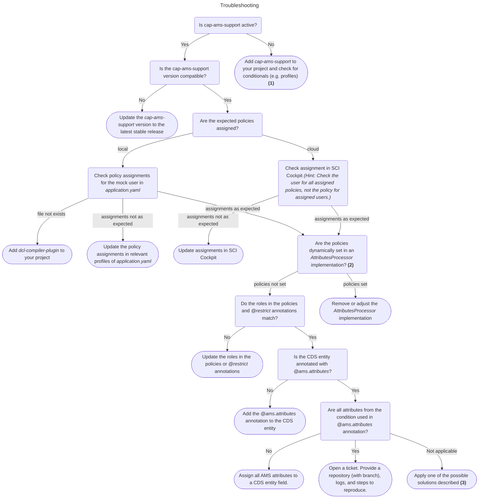

# Authorization Management Service Support for CAP Java Applications
A general description of Authorization Management Service (AMS) and its functionality can be found [here](../jakarta-ams/jakarta-ams.md).
Integrating AMS into applications that use the Cloud Application Programming Model (CAP) is already possible. This can be done
by using, for example, the API provided by `jakarta-ams` and calling it in all required CAP event handlers.
This support module attempts to make the integration of AMS into CAP more convenient.

There is a previous, **deprecated** approach to integrating AMS into CAP Java applications using the `cds2dcl` tool.
The deprecated implementation will continue to work, but using the new approach described in this document is recommended.
A guide for a transition to the new approach can be found [here][1].

## <a id="api-disclaimer"></a>Disclaimer on API Usage
This documentation provides information that might be useful in using Authorization Management Service. We will try to ensure that future versions of the APIs are backwards compatible to the immediately preceding version. This is also true for the API that is exposed with `com.sap.cloud.security.ams.dcl.client` package and its subpackages.  
Please check the [release notes](../releases.md) to stay tuned about new features and API modifications.

## Integration Process
When using this module, the usage of AMS in a CAP Java application works as follows:

1. The application defines its authorization model in terms of roles (e.g. `Admin`, `Specialist`, etc.) and attributes relevant for instance based authorizations.
2. The application developer creates AMS role-policies and an AMS schema with authorization attributes.
3. In the CDS model the application developer annotates the service entities with privileges for the defined roles.
4. The customer assigns the predefined or customized role-policies in which the `RESTRICTED` attributes of the base-policies can be redefined.

### AMS Schema and role policies

```DCL
SCHEMA {
  //defining attributes 
  @valueHelp { ... }  //configure application endpoint for value help
  CompanyId : String,
  
  @valueHelp { ... }
  BusinessSystemType : String,
}
```
This schema defines two attributes, `CompanyId` and `BusinessSystemType,` that can be used in role policies.
The `schema.dcl` must be located on the root level of your DCL folder (common practice `src/main/resources/ams`).
Additional documentation for the value help annotation can be found [here](../../concepts/ValueHelp.md).
The following is a set of role-policies that shows examples for both unrestricted and restricted role assignments. The latter contain a template condition with schema attributes that can be customized by customers for instance-based access by creating admin policies that restrict those attributes.

```DCL
//grant role with additional filter condition
POLICY BusinessConfigurationExpert {
    ASSIGN ROLE BusinessConfigurationExpert WHERE CompanyId IS NOT RESTRICTED AND BusinessSystemType IS NOT RESTRICTED;
}

POLICY TechnicalConfigurationExpert {
    ASSIGN ROLE TechnicalConfigurationExpert;
}

POLICY CarbonAccountant {
    ASSIGN ROLE CarbonAccountant WHERE CompanyId IS NOT RESTRICTED AND BusinessSystemType IS NOT RESTRICTED;
}

//AMS example admin policy
POLICY BusinessConfigurationExpert001 {
    USE BusinessConfigurationExpert RESTRICT CompanyId = '001' AND BusinessSystemType = 'DEV';
}
```

### AMS annotations in CDS

CAP provides a standard [annotation syntax][01] for several use cases.
The following example demonstrates the required CDS/AMS annotations:

```CDS
// link the fields of the entity to the AMS schema attributes
annotate Account with @ams.attributes: {
    CompanyId: (companyId),
    BusinessSystemType: (businessSystemType),
};

annotate ChartOfAccounts with @ams.attributes: {
    BusinessSystemType: {
        element: (businessSystemType),
        attribute: 'BusinessSystemType'
    }
};

// annotate the entities with privileges for the roles
annotate Account with @restrict: [
    {
      grant: 'DRAFT',
      to: 'BusinessConfigurationExpert'
    },
    {
      grant: [ 'CREATE', 'READ', 'UPDATE', 'DELETE' ],
      to: 'BusinessConfigurationExpert',
      // where: additional filter condition is generated by AMS runtime: 'and companyId = '001' and businessSystemType = 'DEV''
    },
    {
      grant: [ 'READ' ],
      to: 'CarbonAccountant',
      // where: additional filter condition is generated by AMS runtime
    },
];

annotate ChartOfAccounts with @restrict: [
    {
      grant: ['READ'],
      to: [ 'BusinessConfigurationExpert', 'CarbonAccountant' ]
      // where: additional filter condition is generated by AMS runtime: 'businessSystemType = 'DEV'
    }
];
```

The example is taken from the documentation linked above.

### Enforcing AMS Policies

By declaring a dependency to the module in the `pom.xml` of the service
```xml
<dependency>
    <groupId>com.sap.cloud.security.ams.client</groupId>
    <artifactId>cap-ams-support</artifactId>
    <version>...</version>
</dependency>
```
two extensions are integrated into the CAP runtime. The `AmsUserInfoProvider` adds CAP roles to the user
assigned via particular grant statements in AMS policies (`...ASSIGN ROLE <roles>...`).
The `AmsAuthorzationHandler` is a regular CAP event handler called whenever CAP performs an authorization check.
For entities annotated for AMS, this handler enforces the assigned AMS policies by attaching conditions to the database query of the current request. 
If the CAP entity is not annotated for AMS, nothing is executed.

If you're transitioning from the previous approach, you activate the new implementation by deleting
the `_dcl_.cap` metadata file which was generated by the `cds2dcl` tool.

### Handling of entities where not all AMS attributes are applicable

One of the main ideas for the AMS-CAP integration is that the attributes defined in AMS have an equivalent
in most entities of the CDS model. However, there might be cases where not all attributes are applicable.
For correct, consistent, and reasonable filter conditions, we need a way to distinguish the cases and
the conditions.

#### Dedicated context attribute

The first option is to add an attribute that indicates if the entity is system-only and add the attribute 
to the conditions. For example:

```SQL
SCHEMA {
    hasSystemOnly : Boolean,
    BusinessSystemId : String,
    CompanyId : String
}

POLICY p1 {
    ASSIGN ROLE CarbonAccountant WHERE CompanyId IS NOT RESTRICTED AND BusinessSystemId IS NOT RESTRICTED AND hasSystemOnly=false;
    ASSIGN ROLE CarbonAccountant WHERE BusinessSystemId IS NOT RESTRICTED AND hasSystemOnly=true;
}
```
For entities with only the `BusinessSystemId` attribute, the `hasSystemOnly` attribute is set to `true`.
Using the given context, the correct value can be set in an `AttributesProcessor` implementation.

#### Using dedicated roles

The second option is to use the roles. For example:
```SQL
SCHEMA {
    BusinessSystemId : String,
    CompanyId : String
}

POLICY p1 {
    ASSIGN ROLE CarbonAccountant WHERE CompanyId IS NOT RESTRICTED AND BusinessSystemId IS NOT RESTRICTED;
    ASSIGN ROLE CarbonAccountantForSystemOnly WHERE BusinessSystemId IS NOT RESTRICTED;
}
```

Entities that have both attributes use the `CarbonAccountant` role; entities that have only
the `BusinessSystemId` use the `CarbonAccountantForSystemOnly` role in the `@restrict` annotation.

#### Using `@cdsEntity` (preferred) <-- new

The third option is to use the `@cdsEntity` annotation on rules to set the context. 
The annotation `@cdsEntity:[a,b,c]` add a condition to the rule, similar to action and resource. The added condition is `AND $dcl.cdsEntity IN [a,b,c]` 
and is evaluated by the AMS runtime. This enables the CAP application to define for which entities the rule is applicable. The annotation is hidden in the UI.  

##### Details (for internal documentation)

The AMS-CAP runtime fills the `$dcl.cdsEntity` context variable with the name of the CDS entity. This can be overridden by the application in a custom `AttributeProvider` implementation, e.g. to introduce a different entity names or aliases. 

```TEXT
POLICY p1 {
    @cdsEntity: ['BusinessSystemService.BusinessSystem']
    ASSIGN ROLE CarbonAccountant WHERE BusinessSystemId IS NOT RESTRICTED;
}

// tranlates to
(AND
    $dcl.action IN ['CarbonAccountant']
    $dcl.resource IN ['$SCOPES']
    $dcl.cdsEntity IN ['BusinessSystemService.BusinessSystem']
    ...where clause...
)
```
The additional condition `$dcl.cdsEntity IN ['BusinessSystemService.BusinessSystem']` can be added by the compiler into the where clause or implemented directly in the DCN engine. 

##### `@cdsEntity` Example

Example taken from a [Stack question](https://sap.stackenterprise.co/questions/75150):

*AMS* 

```TEXT
SCHEMA {
    Documents: {
        attr1: String,
        attr2: String
    }
}

//base policy
POLICY DocumentAdmin {
    ASSIGN ROLE DocumentAdmin
        WHERE Documents.attr1 IS NOT RESTRICTED
        AND Documents.attr2 IS NOT RESTRICTED;
}

//admin policy
POLICY InvoiceDocumentAdmin {
    USE DocumentAI.DocumentAdmin RESTRICT Documents.attr1 = 'invoice';
}
```
*cds* 
```CDS
//service 1
annotate DocumentService1.Documents with @ams.attributes: {
    Documents.attr1: (attr1)
};
annotate DocumentService1.Documents with @restrict: [{
    grant: '*',
    to: ['DocumentAdmin']
};

service DocumentService1 {
  entity Documents {
     attr1: string
  }
}

//service 2
annotate DocumentService2.Documents with @ams.attributes: {
    Documents.attr2: (attr2)
};
annotate DocumentService2.Documents with @restrict: [{
    grant: '*',
    to: ['DocumentAdmin']    
};

service DocumentService2 {
  entity Documents {
     attr2: string
  }
}
```

The expected behavior is that users with the assigned policy `DocumentAdmin` can read all documents from both services. Users with the assigned policy `InvoiceDocumentAdmin` can read only documents with `attr1 = 'invoice'` from the first service and all documents from the second service.
With both attributes in one condition users with the `InvoiceDocumentAdmin` don't get any access to the second service because the condition `attr1 = 'invoice'` evaluates to false. Splitting the conditions would not work either because the filter `attr1 = 'invoice'` stops working for service 1.
So the solution is to use the `@cdsEntity` annotation:

```TEXT
...

//base policy
POLICY DocumentAdmin {
    @cdsEntity: ['DocumentService1.Documents']
    ASSIGN ROLE DocumentAdmin WHERE Documents.attr1 IS NOT RESTRICTED;
    @cdsEntity: ['DocumentService2.Documents']
    ASSIGN ROLE DocumentAdmin WHERE Documents.attr2 IS NOT RESTRICTED;
}

//admin policy
POLICY InvoiceDocumentAdmin {
    USE DocumentAI.DocumentAdmin RESTRICT Documents.attr1 = 'invoice';
}
```

### Customize Attributes

The `AmsUserInfoProvider` and `AmsAuthorizationHandler` also support the request customization
going to the `PolicyDecisionPoint` (PDP) by providing an `AttributeProvider` implementation. The
interface and configuration are described [here](../jakarta-ams/jakarta-ams.md#customize-attributes).
The two integration points require different context information. This is provided by a set of dynamic
arguments available via the method `Principal.getDynamicAttributes()`. Constants for the
dynamic arguments are defined in the `AmsConstants` class.

### Toggles and configuration

Here is a list of features and functionalities that can be switched on/off via configuration. The default
of the configuration might change over time, or a toggle is deleted.

#### Generate `existis` predicate

By setting the property `cds.security.authorization.ams.features.generateExists` to `true`,
the AMS runtime checks annotated paths for `1..*` associations. If such an association is found in a path,
the runtime generates the where-clause using the [CAP exists predicate][03].

## Help and Support

Consult the [AMS documentation](../../index.md) or the documentation
of the other AMS Client Library modules [e.g. jakarta-ams](../jakarta-ams/jakarta-ams.md) for more information.
The [sample application][02] could also be useful.

If you have an issue of type "My user has assigned policy X and I expect Y but get Z", please follow 
the these steps:

### Activate log
Activate the debug log for `com.sap.cloud.security.ams` in your `application.yaml`:
```YAML
logging:
    level:
        com.sap.cloud.security.ams: DEBUG
        com.sap.cloud.security.ams.dcl.capsupport: DEBUG
```
Make sure to add it to all relevant profiles(e.g. `cloud`, `default`). You should now see log entries like:
```TEXT
2025-03-18T14:31:05.926+01:00  WARN 64495 --- [nio-8080-exec-4] c.s.c.s.a.l.PolicyEvaluationSlf4jLogger  : Policy evaluation result: {"operation":"dcr._default_.allowPartial","kind":"FILTER","ignores":"[$env, $app]","unknowns":"[$dcl.action]","$dcl.resource":"$SCOPES","$dcl.principal2policies":"[null, mock/admin]","$dcl.tenant":"null","access":"deny","accessResult":"false"}.
```
 

1. You can check the startup log for:
```TEXT
  .   ____          _            __ _ _
 /\\ / ___'_ __ _ _(_)_ __  __ _ \ \ \ \
( ( )\___ | '_ | '_| | '_ \/ _` | \ \ \ \
 \\/  ___)| |_)| | | | | || (_| |  ) ) ) )
  '  |____| .__|_| |_|_| |_\__, | / / / /
 =========|_|==============|___/=/_/_/_/

 :: Spring Boot ::                (v3.4.0)
...
2025-03-18T14:14:24.022+01:00  INFO 64495 --- [  restartedMain] c.s.c.s.impl.runtime.CdsRuntimeImpl      : Registered handler class com.sap.cloud.security.ams.capsupport.AmsAuthorizationHandler
...
``` 
2. Make sure the policy assignments are not overwritten in an `AttributesProcessor` implementation.
   An indication for this is a log entry like this:
```TEXT
2025-03-18T14:31:05.926+01:00  WARN 64495 --- [nio-8080-exec-4] c.s.c.s.a.l.PolicyEvaluationSlf4jLogger  : Policy evaluation result: {"operation":"dcr._default_.allowPartial",...,"$dcl.policies":"["local..."]",...,"access":"deny","accessResult":"false"}.
```
3. If the entity has not all attributes, check the [Handling of entities where not all AMS attributes are applicable](#handling-of-entities-where-not-all-ams-attributes-are-applicable) section for possible solutions.

[01]: https://cap.cloud.sap/docs/cds/cdl#annotation-syntax
[02]: https://github.com/SAP-samples/ams-samples-java/tree/main/ams-cap-sample
[03]: https://cap.cloud.sap/docs/guides/security/authorization#exists-predicate
